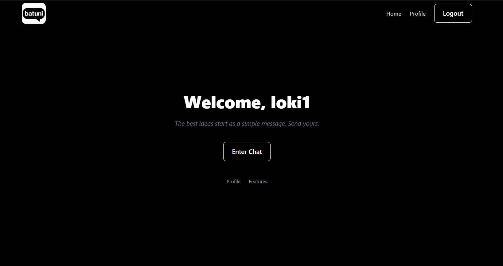
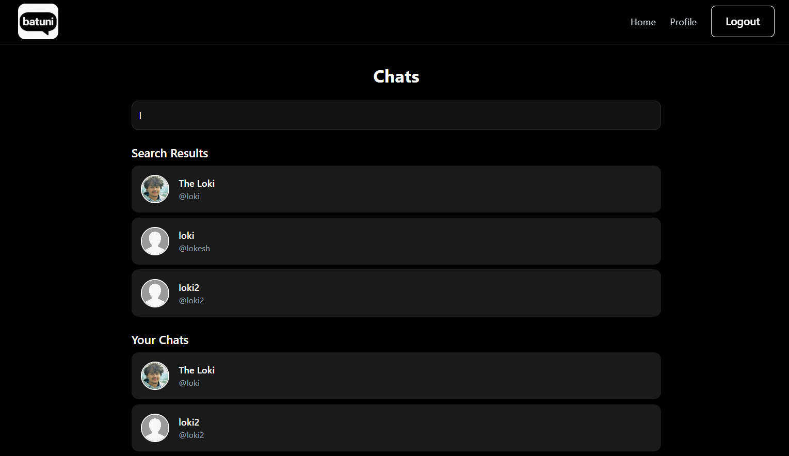
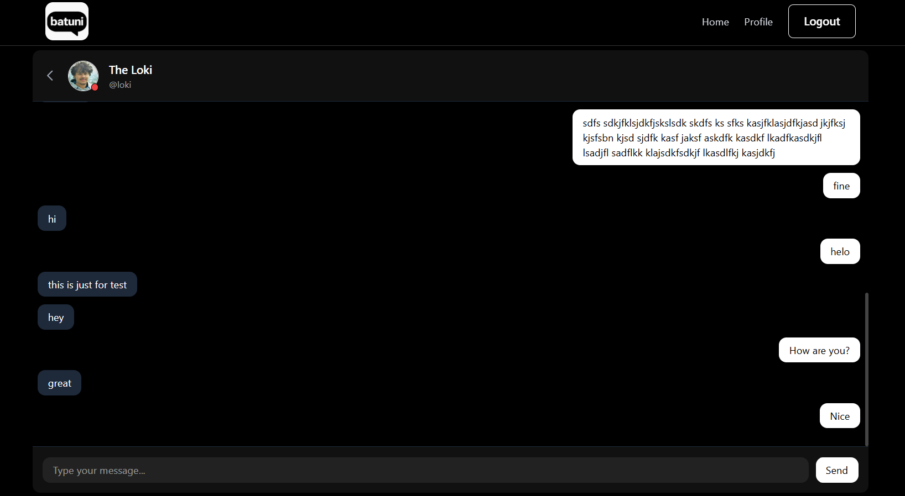
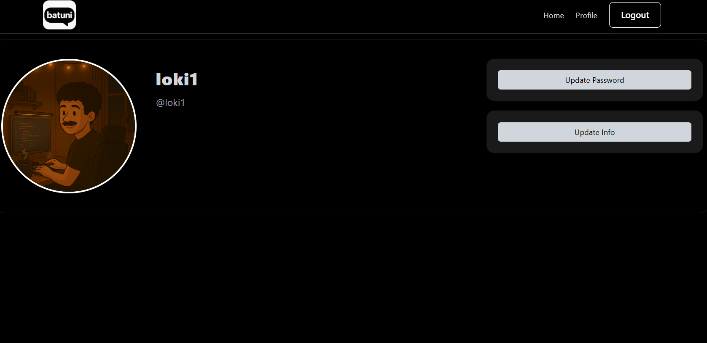

# ChatApp

A real-time chat application built to enable seamless communication between users. This project demonstrates core concepts of modern web development, including user authentication, WebSocket-based instant messaging, and an interactive user interface.

## Features

- **Real-Time Messaging:** Instant message delivery using WebSockets.
- **User Authentication:** Secure login and registration process.
- **Private Chats:** Chat one-on-one.
- **Responsive UI:** Works across devices—mobile, tablet, and desktop.
- **Message History:** Persistent chat history for all conversations.
- **Online Status:** See who is online in real-time.

## Tech Stack

- **Frontend:** (React.js, Tailwind)
- **Backend:** (Node.js with Express)
- **WebSockets:** (Socket.io)
- **Database:** (MongoDB)
- **Authentication:** (JWT)


## Getting Started

### Prerequisites

- Node.js (vXX or above)
- npm / yarn
- (Any other dependencies, e.g., MongoDB running locally)

### Installation

```bash
git clone https://github.com/Lokesh-Dhariyal/ChatApp.git
cd ChatApp
npm install
```

### Running the App

**Development:**

```bash
npm run dev
```

**Production Build:**

```bash
npm run build
npm start
```

### Environment Variables

Create a `.env` file at the project root and configure the following (example):

```
MongoDB_URL = mongodb+srv:-----.mongodb.net
PORT = 6900
ORIGIN = *
CLOUDINARY_CLOUD_NAME = xyz
CLOUDINARY_API_KEY = xyz
CLOUDINARY_API_SECRET = xyz
ACCESS_TOKEN_SECRET = xyz
ACCESS_TOKEN_EXPIRE = xd
REFRESH_TOKEN_SECRET = xyz
REFRESH_TOKEN_EXPIRE = xd
process.env.NODE_ENV = "notProduction"
```

## Usage

1. Register a new account or log in.
2. Search the person you want to chat with.
3. Start messaging in real-time!

## Screenshots





## Roadmap

- [ ] Add file sharing support
- [ ] Implement push notifications
- [ ] Enhance group management features
- [ ] Improve UI/UX

## Contributing

Contributions are welcome! Please fork the repository and submit a pull request.

1. Fork the Project
2. Create your Feature Branch (`git checkout -b feature/AmazingFeature`)
3. Commit your Changes (`git commit -m 'Add some AmazingFeature'`)
4. Push to the Branch (`git push origin feature/AmazingFeature`)
5. Open a Pull Request

## License

Distributed under the MIT License. See [LICENSE](LICENSE) for more information.

## Contact

- **Author:** Lokesh Dhariyal (lokeshdhariyal.me)
- **GitHub:** [Lokesh-Dhariyal](https://github.com/Lokesh-Dhariyal)
- **Email:** (lokeshdhariyal@gmail.com)

---
